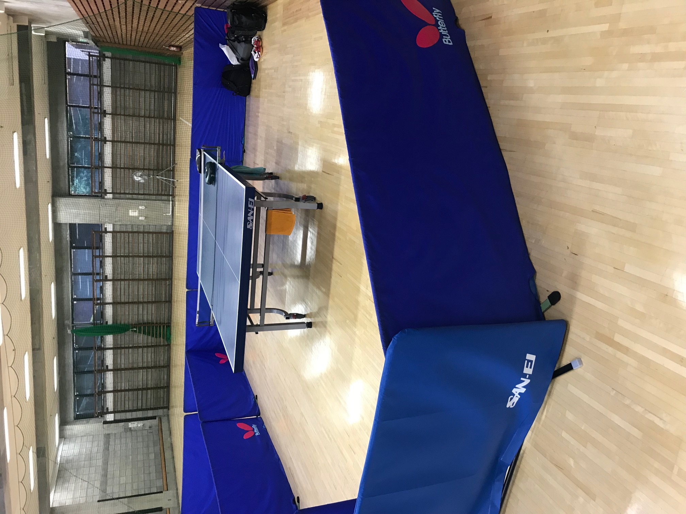
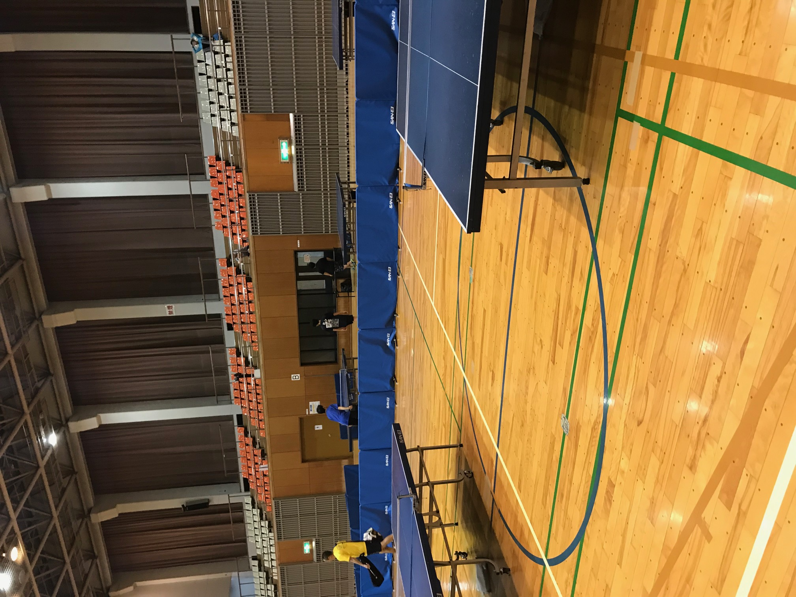
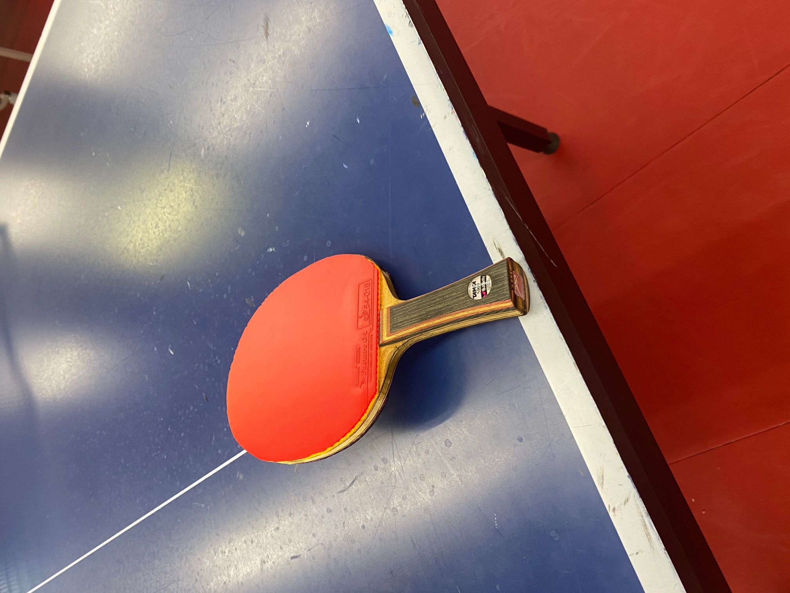

<!DOCTYPE HTML>
  <html lang="ja" dir="ltr">
    <head>
      <meta charset="utf-8">
      <meta name="viewport" content="width=device-width, initial-scale=1, minimum-scale=1, maximum-scale=1, user-scalable=yes">
      <link rel="stylesheet" link rel=”stylesheet” href=”https://hermes100.github.io/mfstabletenis/css/MFS.css” media="screen and (min-width: 801px)">
      <link rel="stylesheet" href="MFSphoone.css" media="screen and (max-width: 800px)">
      
      
      <title>MSF ホームページ</title>
    </head>
    

      <ul>
        <li><a href="C:\Users\user\Desktop\チームHP\MSF_ホームページ.html">トップ</a>
        <li><a href="C:\Users\user\Desktop\チームHP\チームについて.html">チームについて</a>
        <li><a href="C:\Users\user\Desktop\チームHP\練習希望について.html">練習希望について</a></li>
        <li><a href="C:\Users\user\Desktop\チームHP\練習場所.html">練習場所について</a></li>
        <li><a href="C:\Users\user\Desktop\チームHP\練習予定.html">練習日程</a></li>
        <li><a href="C:\Users\user\Desktop\チームHP\試合結果_新.html">試合結果</a>
        <li><a href=>過去記録（データなし）</a></li>
        <li><a href="C:\Users\user\Desktop\チームHP\PWページ.html">その他</a>
        <li><a href=>日記</a></li>
        <li><a href="https://twitter.com/MFS2019?ref_src=twsrc%5Etfw" target="blank">Twitter</a></li>
      </ul>
    

      <!---タイトル部分--->
       <header class='box1'>
           <!---左部分--->
         

            

            

            

         

          <!---真ん中--->
         

           <h1>MFS</h1>
            

              
～立川の卓球チーム～

            

         

           <!---右部分--->
         

         

       </header>

       

         <ul class="menu">
           <li><a href="C:\Users\user\Desktop\チームHP\MFS.ホームページ.html">トップ</a>
           <li><a href="C:\Users\user\Desktop\チームHP\チームについて.html">チームについて</a>
           <ul>
               <li><a href="C:\Users\user\Desktop\チームHP\練習希望について.html">練習希望について</a></li>
               <li><a href="C:\Users\user\Desktop\チームHP\練習場所.html">練習場所について</a></li>
           </ul>
           <li><a href="C:\Users\user\Desktop\チームHP\練習予定.html">練習日程</a></li>
           <li><a href="C:\Users\user\Desktop\チームHP\試合結果_新.html">試合結果</a>
             <ul>
                 <li><a href=>過去記録（データなし）</a></li>
            </ul>
           <li><a href="C:\Users\user\Desktop\チームHP\PWページ.html">その他</a>
           <ul>
               <li><a href=>日記</a></li>
               <li><a href=>リンク</a></li>
          </ul>

     

    <body>
   <!---コメント行--->
   

   
   
   

   
<!--/#viewer-->

       

          

          

           

             

               

                

                

                

              

             

              

                <marquee height="200" width="200" behavior="alternate" direction="up" scrollamount="5" truespeed>
                
                </marquee>
              

            

          

         

      

      

        

          <a class="twitter-timeline" data-width="300" data-height="500" href="https://twitter.com/MFS2019?ref_src=twsrc%5Etfw">Tweets by MFS2019</a> 

        

      

        <h2>Information</h2>

        

           
更新日　10/25

        

          

            
練習日程を更新しました。メニューバーにある「練習日程」から確認できます。

          

          <h2 id="newtime"></h2>
          

             
更新日　10/20

          

            

              
練習日程を更新しました。メニューバーにある「練習日程」から確認できます。

            

            <h2 id="newtime"></h2>
            

               
更新日　10/19

            

              

                
練習日程を更新しました。メニューバーにある「練習日程」から確認できます。

              

              <h2 id="newtime"></h2>
              

                 
更新日　10/12

              

                

                  
練習日程を更新しました。メニューバーにある「練習日程」から確認できます。

                

                <h2 id="newtime"></h2>
                

                   
更新日　10/05

                

                  

                    
練習日程を更新しました。メニューバーにある「練習日程」から確認できます。

                  

                  <h2 id="newtime"></h2>
                  

                     
更新日　9/25

                  

                    

                      
練習日程を更新しました。メニューバーにある「練習日程」から確認できます。

                    

      

     

  　　

        

          

            
チームの概要
          

          <ul>
            <li>2019年チーム結成(結成当時５名)
            <li>立川卓球連盟所属
            <li>現在は２０人あまり
            <li><a href="C:\Users\user\Desktop\チームHP\チームについて.html">詳しくはこちら</a>
          </ul>

        

        

          

            
練習日程
          

            <ul>
              <li>土日祝日がメイン
              <li>まれに平日
              <li><a href="C:\Users\user\Desktop\チームHP\練習予定.html">詳しくはこちら</a>
            </ul>
        

        

          

            
練習場所
          

          <ul>
            <li>日野ピンポン倶楽部や市営の体育館がメイン
            <li>たまに他チームと合同練習もしくは練習試合あり
            <li><a href="C:\Users\user\Desktop\チームHP\練習場所.html">詳しくはこちら</a>
          </ul>

        

     

     

       <a href="C:\Users\user\Desktop\チームHP\メール.html" style="text-decoration:none;"><h2>練習希望、質問などはこちらから</h2></a>
     

      

    </body>
  <!---メッセージ欄--->

       <footer>

         <!---カウンター--->
         <!---javascriptないしはphpでカウントするように後々設定する--->
         

            <ul class="count">
                <li>■訪問者総数:</li>
                <li>■本日の訪問者:</li>
                <li>■昨日の訪問者:</li>
                <li>■月別の訪問者:</li>
            </ul>

         

       </footer>
          

               
Copyright©<a href="file:///C:/Users/user/Desktop/%E3%83%81%E3%83%BC%E3%83%A0HP/MSF_%E3%83%9B%E3%83%BC%E3%83%A0%E3%83%9A%E3%83%BC%E3%82%B8.html"> MFS</a> All Rights Reserved.

          

    </body>
  </html>
